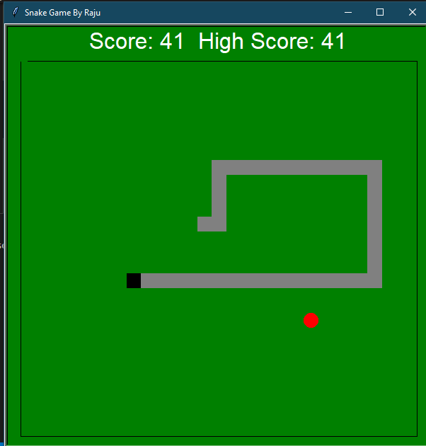
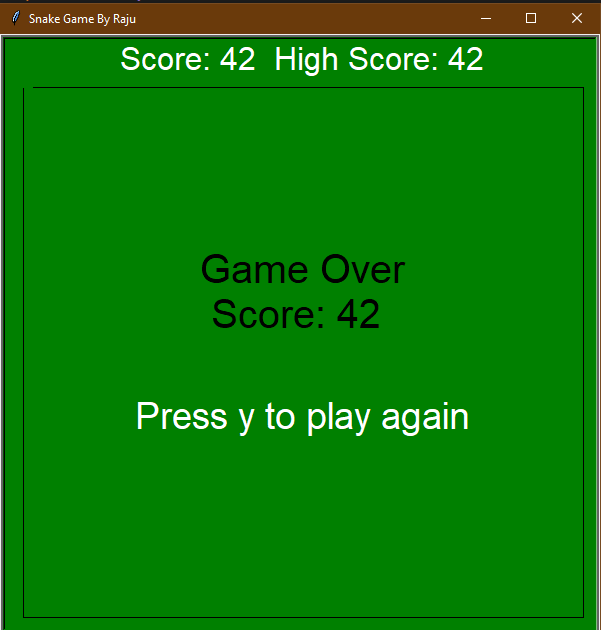

# Snake-Game

Developed this game in 2017, as a fun activity. This is a mimic of the classic Snake game, which used to come in Nokia phones, in earlier days.

W, A , S, D is used for controls, turtle library is used for graphics, and linkedlist is used for snake growth.

Some Screenshots of the game:

